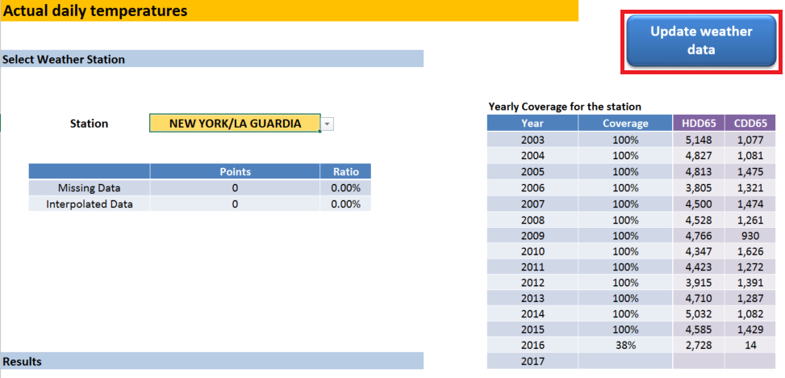
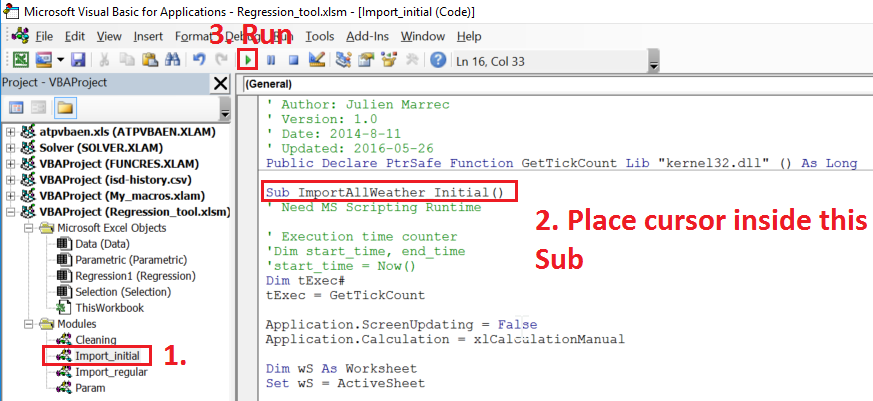

# Weather Data and Weather Normalization


[](https://pypi.org/project/pygsod/)
[](https://pypi.org/project/pygsod/)
[](https://github.com/jmarrec/pygsod/actions/workflows/dev.yml)
[](https://codecov.io/github/jmarrec/pygsod)

## Caveat

**This is a work in progress: The documentation is outdated and lacking, test coverage is low.** But I decided open sourcing was better than not anyways.
Use at your own risk.

## What is this repository for? ###

### Python script to download weather data

* `gsodmain.py` is the python script
* Writen in Python **3.5** (backward compatible with python 2.x as well)
* Downloads weather from NOAA's Global Surface Summary of the Day (GSOD)
    * [Global Surface Summary of the Day](https://data.noaa.gov/dataset/global-surface-summary-of-the-day-gsod) is derived from The Integrated Surface Hourly (ISH) dataset (*Note: also called ISD, Integrated Surface Global Hourly Data, see [here](https://www.ncdc.noaa.gov/isd)*). The ISH dataset includes global data obtained from the USAF Climatology Center, located in the Federal Climate Complex with NCDC (*note: now called NCEI*). The latest daily summary data are normally available 1-2 days after the date-time of the observations used in the daily summaries
    * I'm only pulling dry bulb temperature, but wet bulb, dew point, pressure, wind speed etc are available as well
* Run the script (python gsodmain.py):
    * in "weatherfiles.txt" you have the USAF-WBAN of the stations you want to pull data for
        * You can open "isd-history.csv" and see all the available stations and see the dates for which data is available.
        * isd-history.csv is downloaded in two cases: you don't have it on your disk, or you have it but it's older than 1 month.
        * For example, if you wanted to add "RALEIGH-DURHAM INTERNATIONAL AP" station, you would look at the USAF (723060) and WBAN (13722), and add a new line in `weatherfiles.txt` with `723060-13722`
    * It asks you for a given year, typically you would put the current year, but you could also type 2003 for example and it'll downoad the data for that year
    * Connects to NOAA's ftp and downloads the zipped file (example `724070-93730-2016.op.gz`) of all data for that year for each station you requested
    * It extracts the zipped file (`724070-93730-2016.op`) and deletes it after

### Regression tool

* Tool to weather normalize utility bills.
* Has a few macros to pull the downloaded data once you have run the python script
* I added a button on "Selection" tab marked `Update Weather Data`
    * Opens a terminal window and runs the python script gsodmain.py
        * You have to have python installed, and it should be in your PATH (if you have Anaconda this should be the case!)
        * Python script has to be in the same folder as this Excel Workbook => Basically update it in your cloned bitbucket folder, then you can move it to your project folder...
    * Import the resulting weather data (on hidden tab `Data`)



### Adding a new station ###

* Find the station you want to add in `isd-history.csv`. Check the BEGIN/END column to make sure it has data for the period of time you're interested in (some have stopped recording in the early 1900s...)
* In `Regression_tool.xlsm`, go to hidden tab `Data` and add a new column to the right following the same pattern as the rest: basically fill rows [1-12] (only [2-8] need data, rest is formulas) for this new column using info from the isd-history.csv
* Downloading weather data for multiple years
    * There is also a convenience method in `gsodmain.py` called `download_GSOD_multiple_years()` that will download data for all years between 2003 (included) and the current year.
    * Be smart about it and temporarilly change your `weatherfiles.txt` so that you don't download data for stations for which you already have it. Downloading 15 years for 10 stations you'll need 150 ftp calls, this can both take a while and make NOAA cringe... basically just use that method if you need to add a new station altogether and only put this station's USAF-WBAN in `weatherfiles.txt`
    * Thus, add the USAF-WBAN for your station in weatherfiles.txt, and for now just have this single USAF-WBAN in there
    * Open a cmd prompt, cd to this directory
    * type `python` then the following code

```
from gsodmain import *
download_GSOD_multiple_years()
```
    * This will download data from 2003 until now

* Go back to `Regression_tool.xlsm`
* Open the VB Editor (ALT + F11). Navigate to module "Import_initial", locate `ImportAllWeather_Initial`
    * Change the "USAFWBAN" in the macro to match your new station (locate the portion below)
    * Run the macro

```
' ##########################################################

' Limit the import to the new station you need - CHANGE IT FOR YOUR NEEDS

USAFWBAN = "725020-14734"

' ##########################################################
```




There's also a `Cleaning` module if you need it - when you have missing data:
    * Generally if you use US official weather station (such as airports) you're very unlikely to really need it...
    * If there's missing data, `CleanUpTemps` will take the average of the two days before and two days after the gap, and set the fill of the cell to RED so you have a track record of what was missing.
    * Unless there's more than 7 consecutive days in the gap, in which case it'll tell you where to go so you can choose what you want to do with it.
        * Make sure you Open the "Immediate Window": View > Immediate Window or CTRL + G in the VB Editor.
        * **If you massage it manually, set the cell's background fill to pure red (RGB = (255,0,0))**
    *  You can then run `CountMissing` that will put the total number of "massaged" datapoint in row 11
    * (See Altantic City, rows 3414 and following to see an example)
